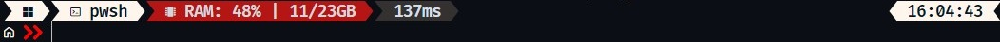

# Oh My Posh

Oh My Posh is a custom prompt engine for any shell. It's designed to make your command line interface more informative and visually appealing.

## 📦 Installation

Visit Oh My Posh website [here](https://ohmyposh.dev/docs/installation/windows "oh my posh") and follow the prompts for your desired shell

## 🎨 Custom Theme

1. Copy the json file to the themes directory - C:\Users\\{{user}}\AppData\Local\Programs\oh-my-posh\themes\
2. Run the script to select a theme using `mrryt.omp.json` instead

mrryt.omp.json

NB: If you cannot find AppData folder, enable show Hidden Items. If persistent, type %appdata% in the address bar, change directory back to AppData and proceed with navigation.

For more terminal customizations, proceed to install Terminal icons [here](https://github.com/devblackops/Terminal-Icons "Terminal Icons GitHub repo")!

## 👁️‍🗨️ Terminal Icons

*Terminal-Icons* is a PowerShell module that adds file and folder icons when displaying items in the terminal. This relies on the custom fonts provided by [Nerd Fonts](https://github.com/ryanoasis/nerd-fonts).

For further PowerShell customizations, proceed to install PSReadline [here](https://github.com/PowerShell/PSReadLine "PSReadline GitHub Repo")!

## 📝 PSReadline

This module replaces the command line editing experience of PowerShell for versions 3 and up. It provides *Syntax coloring, *Simple syntax error notification*, *A good multi-line experience (both editing and history),* and a lot more.

I recommend John Savill's [video](https://www.youtube.com/watch?v=Q11sSltuTE0) (2021) covering installation, configuration, and tailoring PSReadLine to your liking.
